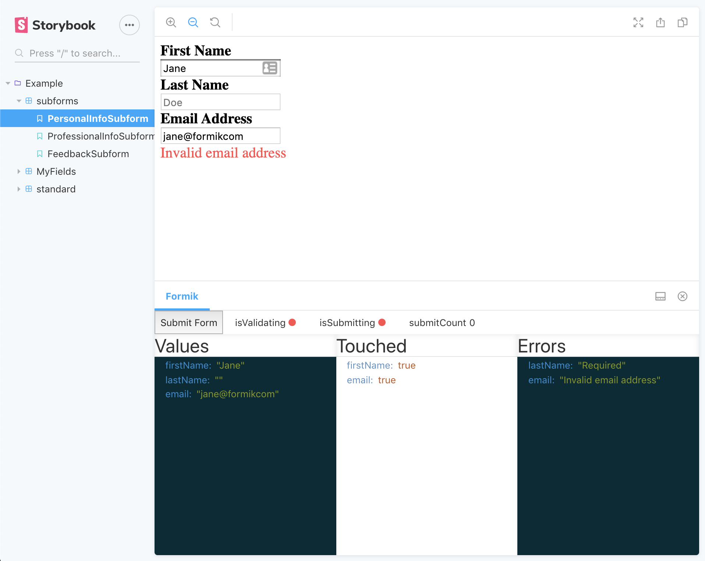

# storybook-formik

A [Storybook](https://storybook.js.org/) Addon and Decorator to wrap Formik Fields and track their state in a Panel.



Thanks to [@jaredpalmer](https://jaredpalmer.com/) for giving us the amazing [formik](https://github.com/jaredpalmer/formik) library and making forms great again.

## Install

```js
npm install --save-dev storybook-formik
```

Then register the addon in `.storybook/addons.js`

```js
import 'storybook-formik/register';
```

## Usage

Suppose you split your forms into smaller, re-usable components and these 'subforms' rely on formik context, each of these
sub-forms may be used to build up a larger form, but you still want to test and run them independently. You can use the withFormik
decorator so that we can wrap the subform in a Formik component, which will pass down the context as normal.

Given a simple subform:

```js
import React from 'react';
import { Field } from 'formik';

const PersonalInfoSubform = () => (
  <div>
    <Field name="forename" type="input" />
    <Field name="surname" type="input" />
  </div>
);

export default PersonalInfoSubform;
```

You add the `withFormik` decorator to your stories and can pass any `Formik` props as a parameter to the individual story.

```js
import { storiesOf } from '@storybook/react';
import withFormik from 'storybook-formik';

import PersonalInfoSubform from '<your_component_path>/PersonalInfoSubform';

storiesOf('Example', module)
  .addDecorator(withFormik)
  .add('default', () => <PersonalInfoSubform />, {
    formik: {
      initialValues: {
        forename: 'John',
        surname: 'Johnerson',
      },
    },
  });
```

This gives you the benefit of rendering formik Fields that are expecting formik context, but also to track the key formik state
within the storybook panel below.

## Arguments

You can pass any `Formik` component props (initialValues, validationSchema, validateOnBlur, etc) as arguments to a story.
These props must be passed under the `formik` parameter key.

If no initial values are supplied, `{}` will be used.

```js
.add('MyTextInput', () => (
    <MyTextInput name="formikTweet" label="Describe formik in 80 characters" placeholder="I love formik because..." />
  ), {
    formik: {
      initialValues: {
        formikTweet: '',
      },
      validationSchema: someSchema,
      onSubmit: (v) => console.log('I want to log these... ', v),
    }
  });
```
